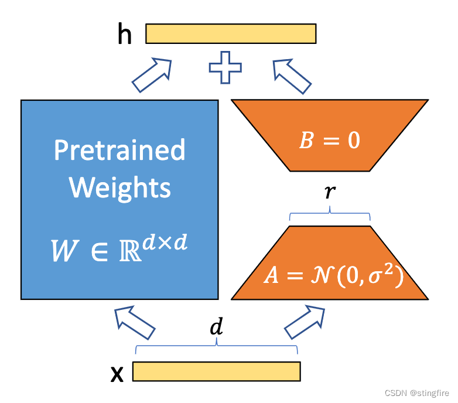
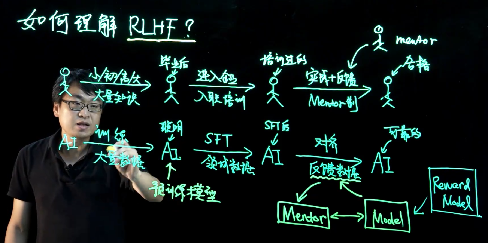
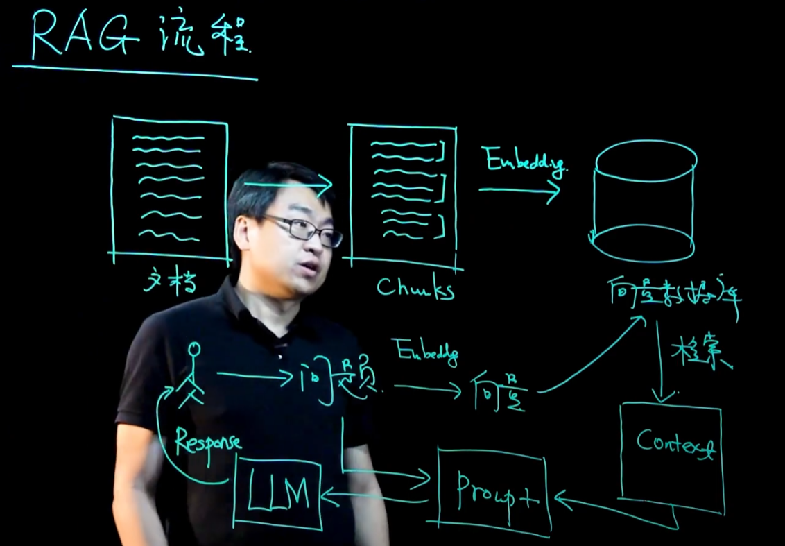

# note
## Finetune
全量微调、层次微调、冻结层次微调
### LoRA
#### 基本原理
如下图所示：对于一个预训练好的基座模型，保留其原有的权重矩阵W不变，仅微调训练更新部分，且这个更新权重矩阵被分解成A和B两个低秩矩阵。下图中A矩阵初始化为高斯分布矩阵，B矩阵初始化为0矩阵。

### Dreambooth

### RLHF(Reinforcement Learning from Human Feedback, 人类反馈强化学习)
RLHF是一种机器学习方法，它通过结合人类提供的反馈来训练模型，实现学习强化和模型性能提升。RLHF被视为强化学习（RL）的一种变体，体现了人机协作的范式

#### RLHF的基本原理
RLHF不依赖打分函数，而是依靠人们的反馈来调优模型。这种独特的奖励机制使得经过RLHF训练的模型能够更大程度与人类的价值观、偏好、思维方式对齐，从而驱动模型的返回结果更符合人类的期待

#### RLHF的主要应用
RLHF目前不仅用于改善模型的文本内容生成，还被用于辅助优化AI图像、音视频等多模态内容的生成。这种方法通过人类反馈的方式，一定程度上补足了机器学习在预训练、无监督学习中的短板，让模型生成的回答更精确、真实，同时减少模型幻觉的发生，有效过滤有害、含歧视性、低质量的内容生成和输出

#### RLHF与PPO、DPO的关系
**PPO**和**DPO**是RLHF场景下两种最常见的深度学习算法。PPO需要来自奖励模型给到的奖励反馈进一步微调模型，而DPO则基于无奖励形式，直接通过简单的分类和偏好来优化策略目标。这两种算法在辅助RLHF训练时各有所长，PPO在极富挑战性的代码竞争中更容易取得最先进的结果，而DPO在学术基准测试中表现较好

#### 流程
预训练大模型->SFT(Supervised Fine-Tuning, 监督微调)->Align(对齐, PPO/DPO)
先通过SFT告诉模型想要的形式，再通过Align告诉模型怎样的结果是不好的
sft: <text, answer>
align: <text, accepted/rejected>

## LLM
### RAG
#### 意义
通过将生成模型与检索模型结合，可以在生成模型的基础上，通过检索模型的方式，提高生成模型的效果，同时，通过生成模型的方式，可以提高检索模型的效果
可用于减少模型幻觉，增强在专业领域的理解能力

