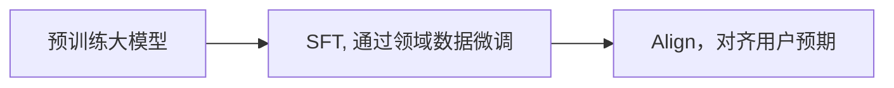

# <text style="color:rgb(140,130,255)">Note</text>

## Finetune
全量微调、层次微调、冻结层次微调

### LoRA
#### 基本原理
如下图所示：对于一个预训练好的基座模型，保留其原有的权重矩阵W不变，仅微调训练更新部分，且这个更新权重矩阵被分解成A和B两个低秩矩阵。下图中A矩阵初始化为高斯分布矩阵，B矩阵初始化为0矩阵。


### Dreambooth
#### 用途
通过少量某物体的图片，使大模型学会生成该物体的图片

### RLHF(Reinforcement Learning from Human Feedback, 人类反馈强化学习)
RLHF是一种机器学习方法，它通过结合人类提供的反馈来训练模型，实现学习强化和模型性能提升。RLHF被视为强化学习（RL）的一种变体，体现了人机协作的范式

#### RLHF的基本原理
RLHF不依赖打分函数，而是依靠人们的反馈来调优模型。这种独特的奖励机制使得经过RLHF训练的模型能够更大程度与人类的价值观、偏好、思维方式对齐，从而驱动模型的返回结果更符合人类的期待

#### RLHF的主要应用
RLHF目前不仅用于改善模型的文本内容生成，还被用于辅助优化AI图像、音视频等多模态内容的生成。这种方法通过人类反馈的方式，一定程度上补足了机器学习在预训练、无监督学习中的短板，让模型生成的回答更精确、真实，同时减少模型幻觉的发生，有效过滤有害、含歧视性、低质量的内容生成和输出

#### RLHF与PPO、DPO的关系
**PPO**和**DPO**是RLHF场景下两种最常见的深度学习算法。PPO需要来自奖励模型给到的奖励反馈进一步微调模型，而DPO则基于无奖励形式，直接通过简单的分类和偏好来优化策略目标。这两种算法在辅助RLHF训练时各有所长，PPO在极富挑战性的代码竞争中更容易取得最先进的结果，而DPO在学术基准测试中表现较好

#### 流程
预训练大模型->SFT(Supervised Fine-Tuning, 监督微调)->Align(对齐, PPO/DPO)
先通过SFT告诉模型想要的形式，再通过Align告诉模型怎样的结果是不好的 (目前主要用DPO)
sft: <text, answer>
align: <text, accepted/rejected>


## LLM
### RAG
#### 意义
通过将生成模型与检索模型结合，可以在生成模型的基础上，通过检索模型的方式，提高生成模型的效果，同时，通过生成模型的方式，可以提高检索模型的效果
可用于减少模型幻觉，增强在专业领域的理解能力


## Image Generation
### Diffusion Model
#### DDPM & DDIM
相比于多数图像生成模型，去噪扩散概率模型（Denoising Diffusion Probabilistic Model, DDPM）的采样速度非常慢。这是因为DDPM在采样时通常要做1000次去噪操作。但实际上，大多数应用只需要20次去噪即可生成图像。这是因为这些应用都使用了一种更快速的采样方法——去噪扩散隐式模型（Denoising Diffusion Implicit Model, DDIM）
基于DDPM，DDIM论文主要提出了两项改进。第一，对于一个已经训练好的DDPM，只需要对采样公式做简单的修改，模型就能在去噪时「跳步骤」，在一步去噪迭代中直接预测若干次去噪后的结果。比如说，假设模型从```T=100```时刻开始去噪，新的模型可以在每步去噪迭代中预测10次去噪操作后的结果，也就是逐步预测时刻```t=90,80,...,0```的结果。这样，DDPM的采样速度就被加速了10倍。第二，DDIM论文推广了DDPM的数学模型，从更高的视角定义了DDPM的前向过程（加噪过程）和反向过程（去噪过程）。在这个新数学模型下，我们可以自定义模型的噪声强度，让同一个训练好的DDPM有不同的采样效果。
**DDPM回顾**
DDPM是一个特殊的VAE。它的编码器是```T```步固定的加噪操作，解码器是```T```步可学习的去噪操作。模型的学习目标是让每一步去噪操作尽可能抵消掉对应的加噪操作。